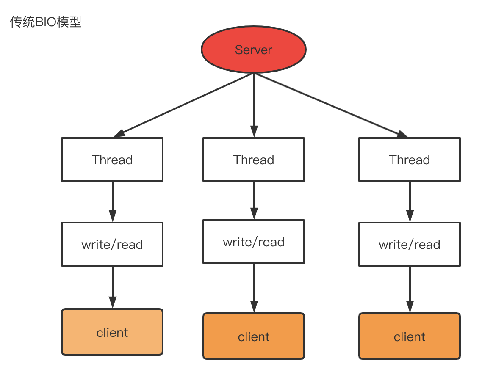
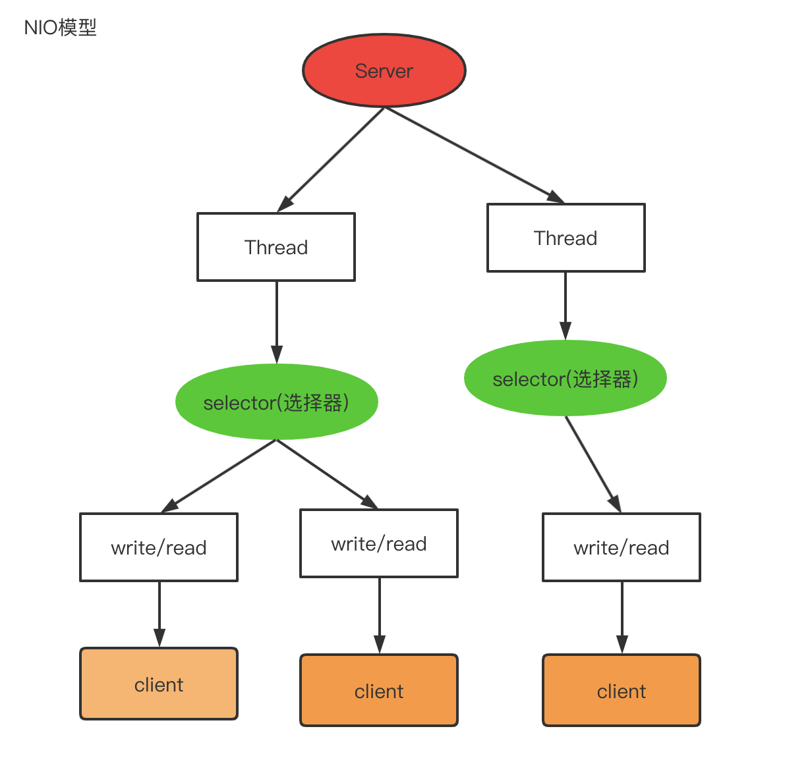
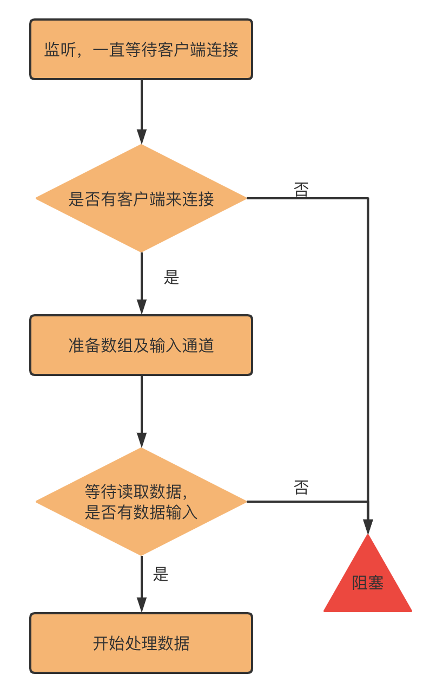

## 1、Java IO概述

## 2．Java IO模型介绍

#### 2.1 基本IO说明

**I/O 模型简单的理解**：就是用什么样的[通道](https://so.csdn.net/so/search?q=%E9%80%9A%E9%81%93&spm=1001.2101.3001.7020)进行数据的发送和接收，很大程度上决定了程序通信的性能  
主要有三种模型：`BIO、NIO、AIO`

1. `Java BIO` ： 同步并阻塞(传统阻塞型)，服务器实现模式为一个连接一个线程，即客户端有连接请求时服务器端就需要启动一个线程进行处理，如果这个连接不做任何事情会造成不必要的线程开销。【*俗话说，占着茅坑不拉屎，这个茅坑还是得被占着*】
   
   
2. `Java NIO` ： 同步非阻塞，服务器实现模式为一个线程处理多个请求(连接)，即客户端发送的连接请求都会注册到多路复用器上，多路复用器（`Selector`）**轮询**到连接有`I/O`请求就进行处理。【*专门有一个老大哥在巡逻，没有事儿，别占着位置*】
   
   
3. `Java AIO`： 异步非阻塞，`AIO` 引入异步通道的概念，采用了 `Proactor`模式，简化了程序编写，有效的请求才启动线程，它的特点是先由操作系统完成后才通知服务端程序启动线程去处理，一般适用于连接数较多且连接时间较长的应用。

## 3. BIO工作机制

是一种阻塞的IO，本质是一个连接一个线程。效率低、资源浪费程度高。

**如何进行BIO编程？**

1. 服务器端启动一个`ServerSocket`

2. 客户端启动`Socket`对服务器进行通信，默认情况下服务器端需要对每个客户 建立一个线程与之通讯

3. 客户端发出请求后, 先咨询服务器是否有线程响应，如果没有则会等待，或者被拒绝

4. 如果有响应，客户端线程会等待请求结束后，在继续执行

看上面的分析图，可以发现阻塞IO会有两个地方会发生阻塞，

1. 如果没有客户端来建立连接，服务器会阻塞
2. 如果客户端没有输入，服务器也会阻塞。

